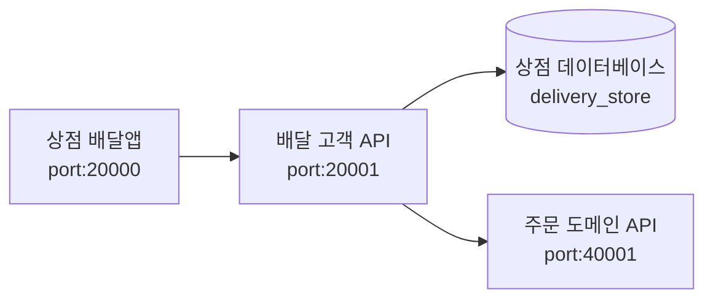

# 프로젝트 
- '주문 도메인 API' 프로젝트
- 주문을 전문적으로 다루는 도메인 API 서비스
- Role: **`delivery-order-api`**
- Port: **`40001`**

# 프로젝트 의존성
- MySQL 설치
  - 데이터베이스: **`food_delivery`**

# Tech Stack
- Spring Boot 3.1.5
- Spring Data JPA

# 시스템 구성과 흐름

# 초기 접속 URL
- http://localhost:40001/

# 초기 계정
- ID: test@test.com
- PW: 1111